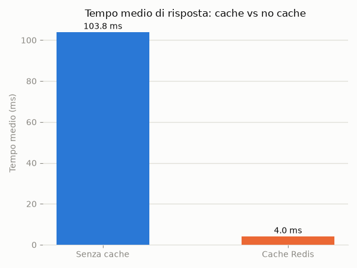

# redis-sample

Dimostra, con numeri, i vantaggi e gli svantaggi del caching con Redis in un
contesto enterprise: una API simula una sorgente dati "lenta" (es. una query
su un sistema legacy), espone una versione con cache Redis e una senza, e un
benchmark strutturato misura la differenza. I risultati si trasformano in
grafici pronti per una presentazione.

## Per chi

Chi deve motivare (o mettere in discussione) l'introduzione di Redis come
cache in un'architettura esistente, con dati alla mano invece che opinioni.

## Stack

- Python 3.12, FastAPI (API dimostrativa) + redis-py
- Terraform + provider `azurerm` per l'istanza Azure Cache for Redis
- Script Python (`benchmark/`, `charts/`) per raccogliere e visualizzare i KPI
- Test: pytest (con `fakeredis`, nessuna istanza Redis reale richiesta)

## Avvio in locale

```bash
pip install -r requirements.txt
uvicorn app.main:app --reload
```

Per usare una cache Redis reale in locale, esporta `REDIS_URL` (es. da
un'istanza Docker o dall'Azure Cache for Redis creata via Terraform) prima di
avviare l'app. Senza `REDIS_URL` l'endpoint cache si comporta come un
no-op, utile per sviluppare senza dipendenze esterne.

## Endpoint disponibili

- `GET /health` — controllo di stato, risponde sempre 200.
- `GET /data/nocache/{item_id}` — simula una sorgente dati lenta (50-150ms
  di latenza artificiale), base per il confronto con la versione con cache
  Redis.
- `GET /data/cached/{item_id}` — stessa sorgente lenta, ma il risultato
  viene letto/scritto su Redis con TTL di 30s prima di rifare il lavoro
  costoso. Senza `REDIS_URL` impostata si comporta come `nocache` (nessun
  crash, nessuna dipendenza esterna richiesta in sviluppo).

Esempio:

```bash
$ curl -w '\ntempo: %{time_total}s\n' http://127.0.0.1:8000/data/nocache/1
{"item_id":1,"source":"nocache","value":42}
tempo: 0.104s

$ curl -w '\ntempo: %{time_total}s\n' http://127.0.0.1:8000/data/cached/1
{"item_id":1,"value":42,"source":"cached"}
tempo: 0.098s

$ curl -w '\ntempo: %{time_total}s\n' http://127.0.0.1:8000/data/cached/1
{"item_id":1,"value":42,"source":"cached"}
tempo: 0.002s
```

## Test

```bash
pytest
```

## Benchmark e grafici

```bash
python benchmark/run_benchmark.py   # produce un CSV con i tempi di risposta
python charts/generate_charts.py    # legge il CSV e genera i grafici KPI
```

`run_benchmark.py` accetta `--base-url` (default `http://localhost:8000`),
`-n/--requests` (default 50) e `--output` (default `benchmark/results.csv`).
Esegue N richieste su `/data/nocache/{id}` e N su `/data/cached/{id}`,
scrive `benchmark/results.csv` con colonne
`endpoint,item_id,request_index,response_time_ms` e stampa un riepilogo:

```bash
$ python benchmark/run_benchmark.py -n 20
Risultati salvati in benchmark/results.csv
/data/nocache: mean=109.89ms p50=108.59ms p95=135.67ms
/data/cached: mean=7.82ms p50=1.54ms p95=2.07ms
```

(esempio con `REDIS_URL` configurata; senza cache reale `/data/cached` si
comporta come `/data/nocache`, come descritto sopra).

`generate_charts.py` accetta il percorso del CSV come primo argomento
(default `benchmark/results.csv`) e `--output-dir` (default `charts/output`).
Legge il CSV e genera tre grafici PNG, pronti per una presentazione:

- `mean_response_time.png` — tempo medio di risposta, cached vs nocache.
- `percentiles.png` — percentili p50/p95/p99 per i due endpoint.
- `response_time_distribution.png` — distribuzione dei tempi di risposta.

Se il CSV non esiste ancora (nessun benchmark eseguito), lo script stampa un
messaggio invece di terminare con uno stack trace.

## Infrastruttura (Azure)

```bash
cd terraform
terraform init
terraform apply
```

Crea un resource group e un'istanza Azure Cache for Redis (tier Basic) da
usare per i test contro un servizio reale (non solo in locale).

Per passare l'istanza appena creata a `REDIS_URL`:

```bash
export REDIS_URL="rediss://:$(terraform output -raw redis_primary_access_key)@$(terraform output -raw redis_hostname):$(terraform output -raw redis_ssl_port)/0"
```

Lo schema `rediss://` forza la connessione TLS, richiesta dall'istanza Azure
(porta SSL, TLS minimo 1.2). Per distruggere le risorse a fine test:
`terraform destroy`.

## Screenshot

Esempio di grafico generato da `charts/generate_charts.py` (tempo medio di
risposta, cached vs nocache):


